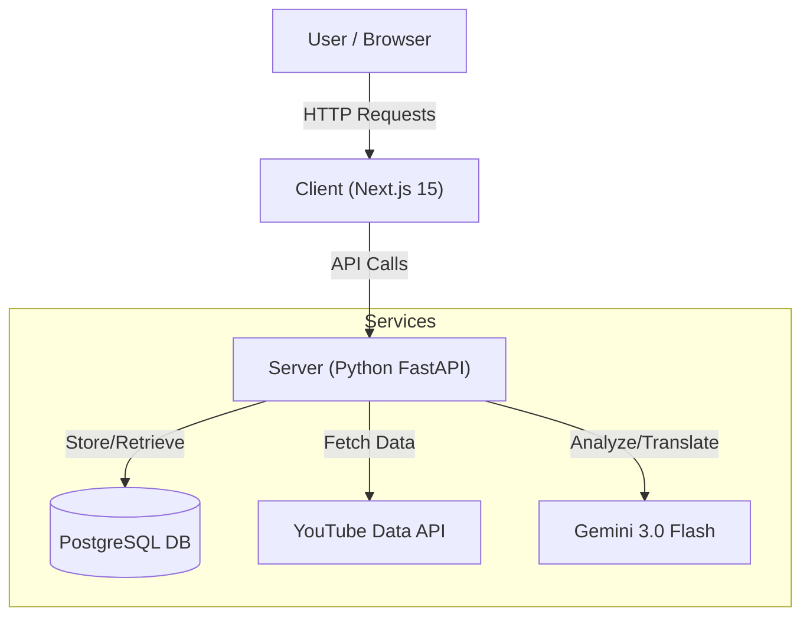

# YouTube Video Analysis & Insights
> Unlocking the hidden value in YouTube comments with AI.

**YouTube Video Analysis** is a powerful web application that transforms raw YouTube comments into actionable insights using **Google Gemini 3.0 Flash**. It provides content creators and marketers with instant sentiment analysis, common themes, and audience feedback, all wrapped in a premium, modern interface.

## 🚀 Project Scope & Summary
The goal of this project is to provide a seamless, "one-click" analysis tool. Users simply paste a YouTube URL, and the system handles the rest: fetching metadata, scraping comments, and running advanced LLM prompts to distill thousands of words into a clear, visual report.

### Key Features
- **📊 Deep Analytics**: View counts, likes, and comment volume at a glance.
- **🧠 AI Sentiment Analysis**: Detects overall audience mood (Positive/Neutral/Negative) with a visual score.
- **💡 Smart Insights**:
    - **Key Takeaways**: The "tl;dr" of the comment section.
    - **Common Themes**: What everyone is talking about.
    - **Issues & Problems**: Bug reports and complaints.
    - **What People Love**: Positive highlights.
- **🌍 Multi-Language Support**:
    - **UI Localization**: Switch between English (LTR) and Arabic (RTL).
    - **AI Translation**: Instantly translate analysis results between English and Arabic.
- **💾 History & Persistence**: Automatically saves every analysis to a robust PostgreSQL database.
- **📄 Exportable Reports**: Download professional PDF reports of your analysis.

## 🏗 Architecture
The project follows a **Dockerized Microservices** architecture for scalability and isolation.



## 🔮 Future Updates
- **Topic Clustering**: visualizing comment clusters.
- **Competitor Analysis**: Compare two videos side-by-side.
- **User Accounts**: Personalized dashboards and saved collections.
- **Export to CSV/Excel**: For raw data analysis.

## 🛠 Tech Stack
- **Frontend**: Next.js 15, React, CSS Modules (Glassmorphism UI), Framer Motion.
- **Backend**: Python 3.9, FastAPI, SQLAlchemy, Pydantic.
- **Database**: PostgreSQL 15.
- **AI/ML**: Google Gemini 3.0 Flash Preview.
- **DevOps**: Docker, Docker Compose.

---

## 🔑 Getting Credentials
You need two API keys to run this application.

### 1. YouTube Data API v3 Key
1. Go to the [Google Cloud Console](https://console.cloud.google.com/).
2. Create a new project (e.g., "YouTube Analysis").
3. In the search bar, type **"YouTube Data API v3"** and select it.
4. Click **Enable**.
5. Go to **Credentials** -> **Create Credentials** -> **API Key**.
6. Copy the key.

### 2. Google Gemini API Key
1. Go to [Google AI Studio](https://aistudio.google.com/).
2. Sign in with your Google account.
3. Click on **"Get API key"** in the sidebar.
4. Click **"Create API key"**.
5. Copy the key.

---

## 🏃‍♂️ How to Run

1. **Clone the repository**:
   ```bash
   git clone <repo-url>
   cd Youtube-Video-Analysis
   ```

2. **Set up Environment Variables**:
   Copy the example file and add your keys.
   ```bash
   cp .env.example .env
   ```
   Open `.env` and fill in your keys:
   ```env
   YOUTUBE_API_KEY=your_youtube_key_here
   GEMINI_API_KEY=your_gemini_key_here
   ```

3. **Run with Docker Compose** (Recommended):
   ```bash
   docker-compose up --build
   ```
   - Frontend will be at: `http://localhost:3000`
   - Backend will be at: `http://localhost:5001`

---

## 🏗️ Project Structure
```
/
├── client/            # Next.js Frontend
├── server/            # Express Backend
├── .env.example       # Environment variables template
├── docker-compose.yml # Orchestration
└── README.md          # This file
```
